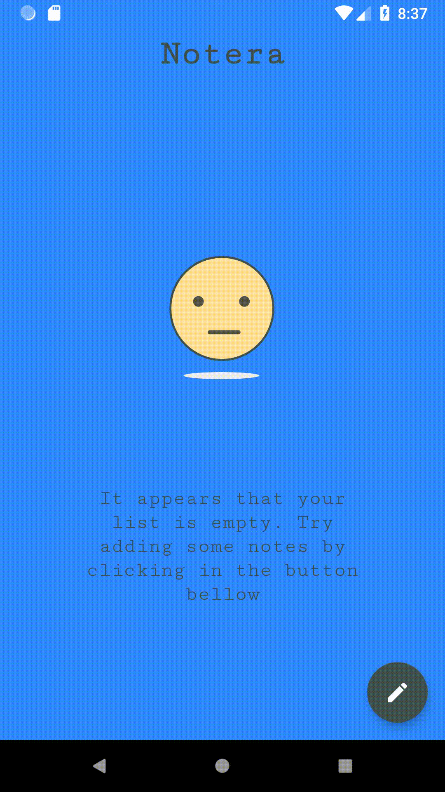
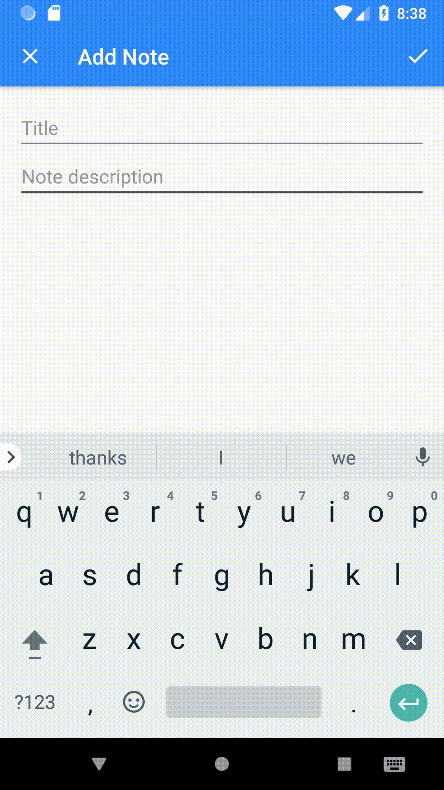

# Notera
This app is intended to be a practical study of the MVVM Architecture and the AndroiX Architecture Components.

## Preview
|Empty            | Add/Remove
| :-------------: |:-------------:|
|  |  

It was based on this tutorial: [Android Architecture Components Beginner](https://www.youtube.com/playlist?list=PLrnPJCHvNZuDihTpkRs6SpZhqgBqPU118)
From [Coding in Flow](https://www.youtube.com/channel/UC_Fh8kvtkVPkeihBs42jGcA)
